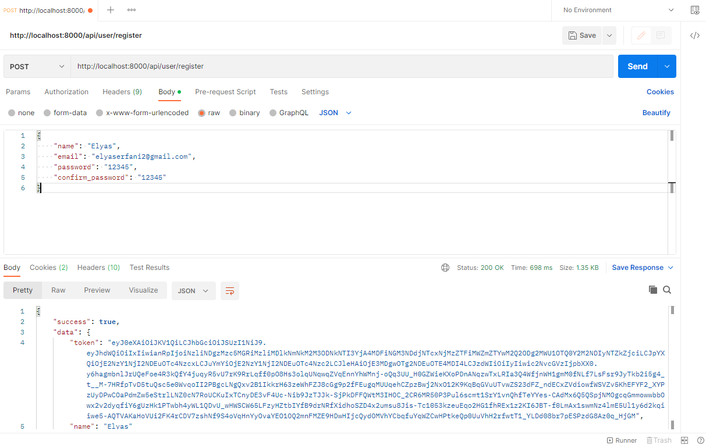
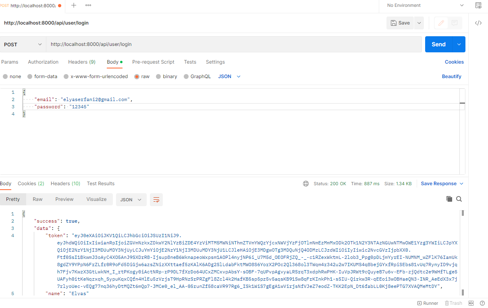
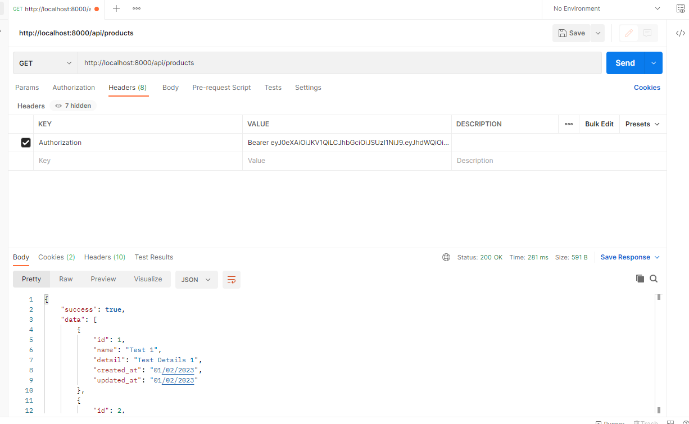
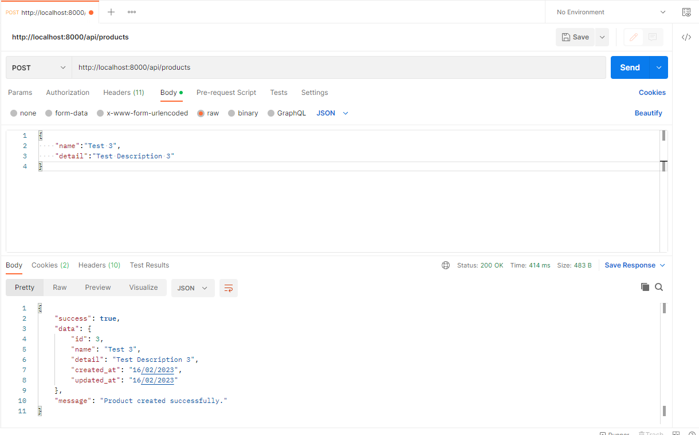
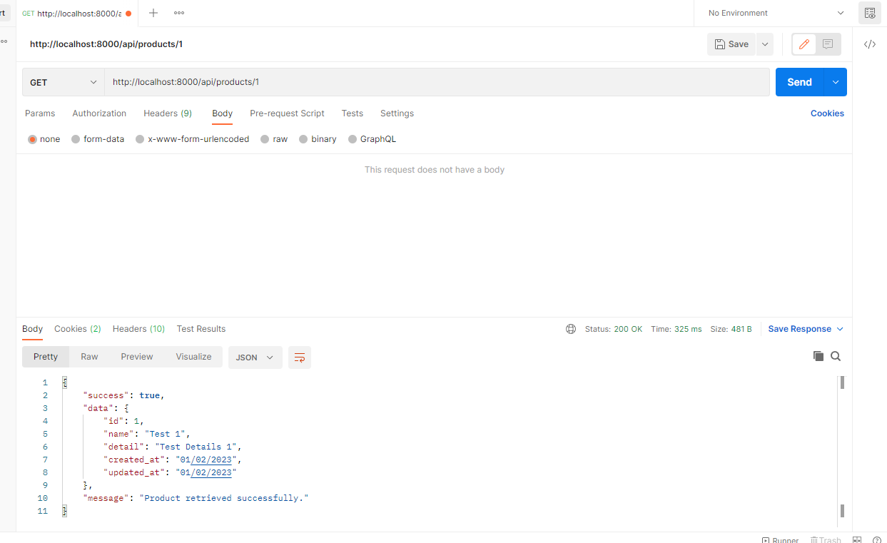
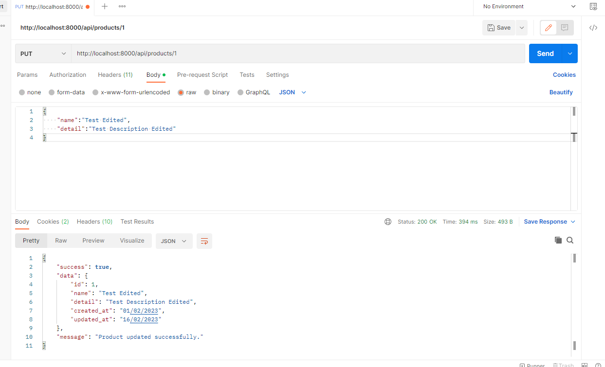
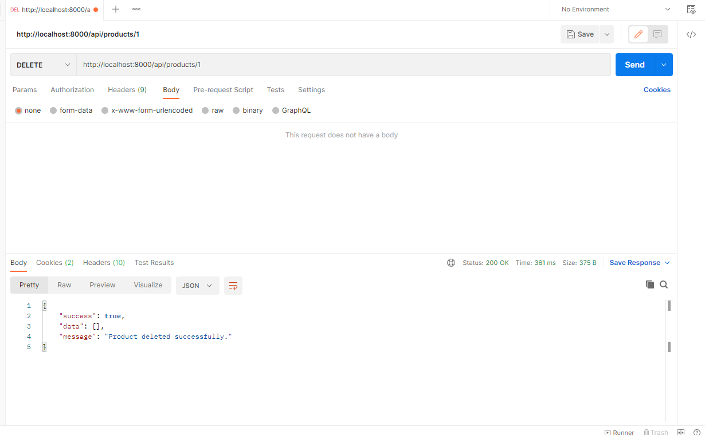

# Laravel Version 9 Simple Crud With Authentication

<p>Laravel v9 simple crud with <b>Passport</b> authentication . This projects uses :</p>
<ul>
  <li>Passport</li>
  <li>Nginx</li>
  <li>PHP</li>
  <li>MySQL</li>
  <li>PhpMyAdmin</li>
</ul>

## Installation And Build :

.env :

```
DB_CONNECTION=mysql
DB_HOST=localhost
DB_PORT=33061
DB_DATABASE=laravel
DB_USERNAME=laravel-user
DB_PASSWORD=laravel-password
```

```
docker-compose up -d
docker-compose exec app php artisan key:generate
docker-compose exec app php artisan optimize
composer install
php artisan serve
```

## After creating docker container you can visit :

</br>

PhpMyAdmin : `http://localhost:8888/`
</br>
</br>
Laravel App : `http://localhost:8000/`
</br>
</br>

## Avaliable Routes :

</br>

User Register : `http://localhost:8000/api/user/register`
</br>


</br>

User Login : `http://localhost:8000/api/user/login`
</br>



</br>

Get Products List : `http://localhost:8000/api/products`
</br>



</br>

Create Product : `http://localhost:8000/api/products`
</br>



</br>

Get Single Product : `http://localhost:8000/api/products/{id}`
</br>



</br>

Update Single Product : `http://localhost:8000/api/products/{id}`
</br>



</br>

Delete Product : `http://localhost:8000/api/products/{id}`
</br>


